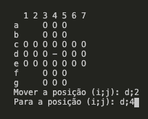

# Resta Um

## Sobre

Resta um é um quebra-cabeça no qual o objetivo é deixar **apenas uma peça** no
tabuleiro.

## Instruções

No início do jogo, há 32 peças no tabuleiro, deixando vazia a posição central.

### Movimento 

Um movimento consiste em pegar uma peça e fazê-la "saltar" sobre outra peça,
sempre na horizontal ou na vertical, terminando em um espaço vazio. A peça que
foi "saltada" é retirada do tabuleiro.

#### Como mover

Cada movimento exige 2 inputs, origem e destino respectivamente, cada input consiste em uma linha e coluna, representados por uma letra e uma número respectivamente, seperados por ; .

Ex: movimentar a peça da linha 4 e coluna 2 para a linha 4 e coluna 4, então o primeiro input será d;2 e o segundo d;4. 

### Término

O jogo termina quando não mais é possível fazer nenhum outro movimento. Nesta ocasião, o jogador ganha se restar apenas
uma peça no tabuleiro.